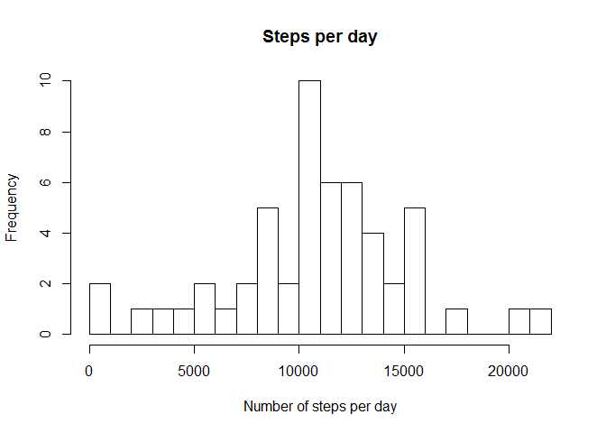
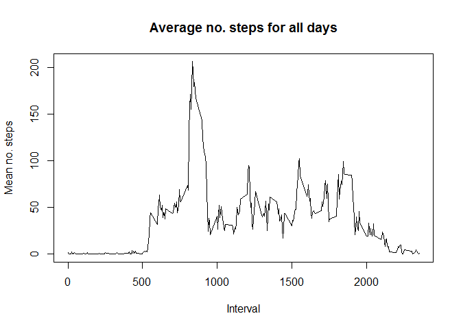
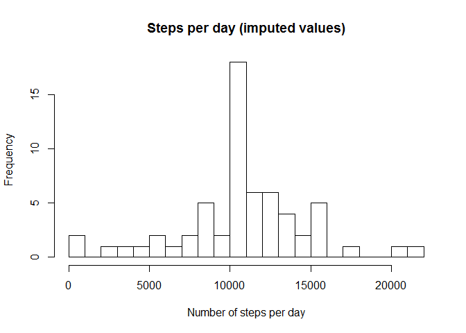
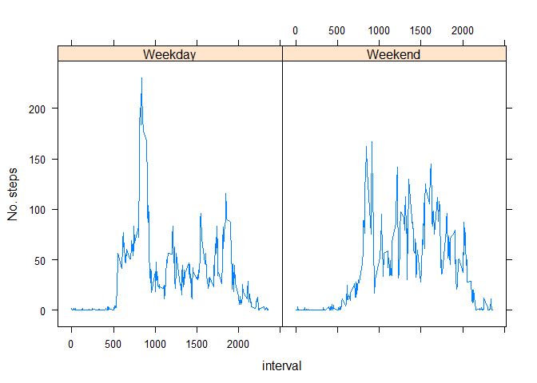

# Reproducible Research: Peer Assessment 1


## Introduction
It is now possible to collect a large amount of data about personal movement using activity monitoring devices such as a Fitbit, Nike Fuelband, or Jawbone Up. These type of devices are part of the “quantified self” movement – a group
of enthusiasts who take measurements about themselves regularly to improve their health, to find patterns in their behavior, or because they are tech geeks.
But these data remain under-utilized both because the raw data are hard to obtain and there is a lack of statistical methods and software for processing and interpreting the data. This assignment makes use of data from a personal activity monitoring device. This device collects data at 5 minute intervals through out the day. The data consists of two months of data from an anonymous individual collected during the months of October and November, 2012 and include the number of steps taken in 5 minute intervals each day.

## Data
The data for this assignment can be downloaded from the course web site:

- Dataset: Activity monitoring data [52K]

The variables included in this dataset are:

- steps: Number of steps taking in a 5-minute interval (missing values are coded as NA)
- date: The date on which the measurement was taken in YYYY-MM-DD format
- interval: Identifier for the 5-minute interval in which measurement was taken

The dataset is stored in a comma-separated-value (CSV) file and there are a total of 17,568 observations in this dataset.

## Assignment

This assignment will be described in multiple parts. You will need to write a report that answers the questions detailed below. Ultimately, you will need to complete the entire assignment in a *single R markdown* document that canbe processed by *knitr* and be transformed into an HTML file.

Assignment report
==========================================

## Load necessary packages


```r
library(rmarkdown)
library(dplyr)
```

```
## Warning: package 'dplyr' was built under R version 3.2.5
```

```
## 
## Attaching package: 'dplyr'
```

```
## The following objects are masked from 'package:stats':
## 
##     filter, lag
```

```
## The following objects are masked from 'package:base':
## 
##     intersect, setdiff, setequal, union
```

```r
library(lubridate)
library(lattice)
```

## Download the data


```r
# download the data set into working directory and unzip
url = "https://d396qusza40orc.cloudfront.net/repdata%2Fdata%2Factivity.zip"
temp <- tempfile()
download.file(url,temp)
unzip(temp, "activity.csv")
```

## Load the data


```r
activity <- read.csv("activity.csv", header = TRUE)
# check data

head(activity, n = 10)
```

```
##    steps       date interval
## 1     NA 2012-10-01        0
## 2     NA 2012-10-01        5
## 3     NA 2012-10-01       10
## 4     NA 2012-10-01       15
## 5     NA 2012-10-01       20
## 6     NA 2012-10-01       25
## 7     NA 2012-10-01       30
## 8     NA 2012-10-01       35
## 9     NA 2012-10-01       40
## 10    NA 2012-10-01       45
```

### What is mean total number of steps taken per day?
For this part of the assignment, you can ignore the missing values in the dataset.

1. Make a histogram of the total number of steps taken each day
2. Calculate and report the mean and median total number of steps taken per day


```r
dailysteps <- activity %>%
  filter(!is.na(steps)) %>%
  group_by(date) %>%
  summarise(total = sum(steps))
        

# histogram of total steps per day
hist(dailysteps$total,
     main = "Steps per day",
     xlab = "Number of steps per day",
     breaks = 20)
```

<!-- -->

```r
# mean and median steps per day
summary(dailysteps)
```

```
##          date        total      
##  2012-10-02: 1   Min.   :   41  
##  2012-10-03: 1   1st Qu.: 8841  
##  2012-10-04: 1   Median :10765  
##  2012-10-05: 1   Mean   :10766  
##  2012-10-06: 1   3rd Qu.:13294  
##  2012-10-07: 1   Max.   :21194  
##  (Other)   :47
```

**The mean number of steps per day is 10766 steps and the median number is 10765.**

### What is the average daily activity pattern?

1. Make a time series plot (i.e. type = "l") of the 5-minute interval (x-axis) and the average number of steps taken, averaged across all days (y-axis)

2. Which 5-minute interval, on average across all the days in the dataset, contains the maximum number of steps?


```r
intervalsteps <- aggregate(steps ~ interval, activity, mean)
plot(intervalsteps$interval, intervalsteps$steps, type='l', 
     main="Average no. steps for all days", xlab="Interval", 
     ylab="Mean no. steps")
```

<!-- -->

```r
moststeps <- which.max(intervalsteps$steps)

intervalsteps[moststeps, ]
```

```
##     interval    steps
## 104      835 206.1698
```
**Interval 835 has the maximum average value of steps (206.1698).**

### Imputing missing values

Note that there are a number of days/intervals where there are missing values (coded as NA). The presence of missing days may introduce bias into some calculations or summaries of the data.

Calculate and report the total number of missing values in the dataset (i.e. the total number of rows with NAs)

Devise a strategy for filling in all of the missing values in the dataset. The strategy does not need to be sophisticated. For example, you could use the mean/median for that day, or the mean for that 5-minute interval, etc.

Create a new dataset that is equal to the original dataset but with the missing data filled in.

Make a histogram of the total number of steps taken each day and Calculate and report the mean and median total number of steps taken per day. Do these values differ from the estimates from the first part of the assignment? What is the impact of imputing missing data on the estimates of the total daily number of steps?


```r
# function to count missing values in activity data
sapply(activity, function(x) sum(is.na(x)))
```

```
##    steps     date interval 
##     2304        0        0
```

**Total number of rows with NA's is 2304.**


```r
# My approach: fill in missing values with the average number of steps in an interval

activity_nona <- activity
missing <- is.na(activity_nona$steps) # logical vector with TRUE for NA
replace <- tapply(activity_nona$steps, activity_nona$interval, mean, na.rm=TRUE, simplify=TRUE)
activity_nona$steps[missing] <- replace[as.character(activity_nona$interval[missing])]

# check for missing values
sum(is.na(activity_nona$steps))
```

```
## [1] 0
```
**There are no missing values left in the data set.**

### Make a histogram (total number of daily steps)


```r
xx <- activity_nona %>%
  filter(!is.na(steps)) %>%
  group_by(date) %>%
  summarise(steps = sum(steps))
 
# check data set
head(xx, n = 10)
```

```
## # A tibble: 10 × 2
##          date    steps
##        <fctr>    <dbl>
## 1  2012-10-01 10766.19
## 2  2012-10-02   126.00
## 3  2012-10-03 11352.00
## 4  2012-10-04 12116.00
## 5  2012-10-05 13294.00
## 6  2012-10-06 15420.00
## 7  2012-10-07 11015.00
## 8  2012-10-08 10766.19
## 9  2012-10-09 12811.00
## 10 2012-10-10  9900.00
```

```r
# histogram of total steps per day (with imputed values)
hist(xx$steps,
     main = "Steps per day (imputed values)",
     xlab = "Number of steps per day",
     breaks = 20)
```

<!-- -->

### Calculate mean and median (total daily steps) after imputing missing values


```r
# mean and median steps per day
summary(xx)
```

```
##          date        steps      
##  2012-10-01: 1   Min.   :   41  
##  2012-10-02: 1   1st Qu.: 9819  
##  2012-10-03: 1   Median :10766  
##  2012-10-04: 1   Mean   :10766  
##  2012-10-05: 1   3rd Qu.:12811  
##  2012-10-06: 1   Max.   :21194  
##  (Other)   :55
```
**These new values differ slightly from the old values: median and mean are both the same (10766).**

### Are there differences in activity patterns between weekdays and weekends?
For this part the weekdays() function may be of some help here. Use the dataset with the filled-in missing values for this part.

1. Create a new factor variable in the dataset with two levels - "weekday" and "weekend" indicating whether a given date is a weekday or weekend day.

2. Make a panel plot containing a time series plot (i.e. type = "l") of the 5-minute interval (x-axis) and the average number of steps taken, averaged across all weekday days or weekend days (y-axis).


```r
# create a new factor level in the dataset with 2 levels: weekend and weekday

activity_nona$date <- ymd(activity_nona$date)
activity_nona$weekday <- weekdays(activity_nona$date)
activity_nona$weekend <- ifelse (activity_nona$weekday == "Samstag" | activity_nona$weekday == "Sonntag", "Weekend", "Weekday")
activity_nona$weekend <- as.factor(activity_nona$weekend)
activity_nona$weekday <- as.factor(activity_nona$weekday)
head(activity_nona,10)
```

```
##        steps       date interval weekday weekend
## 1  1.7169811 2012-10-01        0  Montag Weekday
## 2  0.3396226 2012-10-01        5  Montag Weekday
## 3  0.1320755 2012-10-01       10  Montag Weekday
## 4  0.1509434 2012-10-01       15  Montag Weekday
## 5  0.0754717 2012-10-01       20  Montag Weekday
## 6  2.0943396 2012-10-01       25  Montag Weekday
## 7  0.5283019 2012-10-01       30  Montag Weekday
## 8  0.8679245 2012-10-01       35  Montag Weekday
## 9  0.0000000 2012-10-01       40  Montag Weekday
## 10 1.4716981 2012-10-01       45  Montag Weekday
```

```r
activity_nona2 <- aggregate(activity_nona$steps, by=list(activity_nona$weekend, activity_nona$interval), mean)
names(activity_nona2)[1] ="weekend"
names(activity_nona2)[2] ="interval"
names(activity_nona2)[3] ="steps"

# make a time series panel plot

xyplot(steps ~ interval | weekend, 
       data = activity_nona2,
        type = "l",
       ylab = "No. steps")
```

<!-- -->

**Comparison of the weekend and weekday plots show that the monitored person begins activity later on weekends than on weekdays but takes more steps during the active period during the weekends.**
